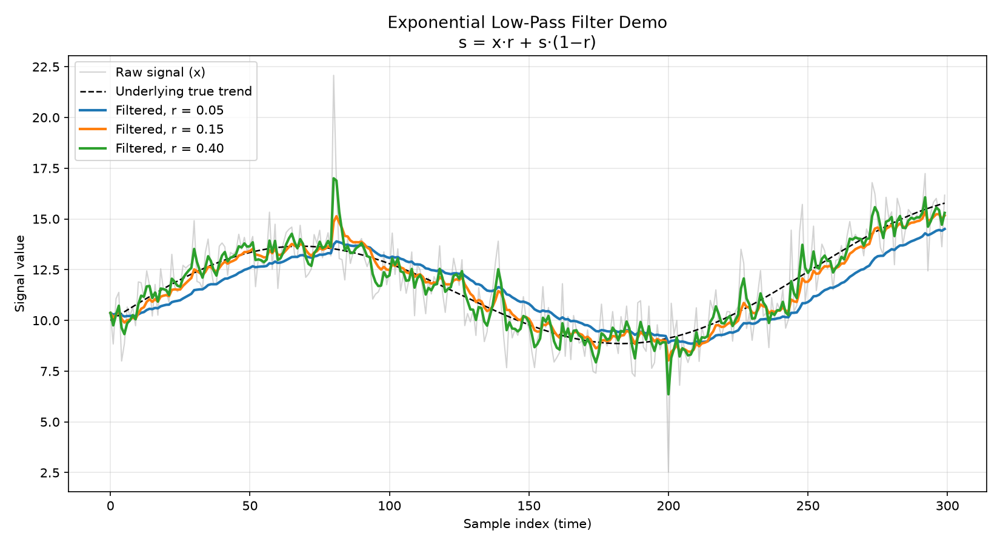

# DES222 Task 2 - Process Journal

# Prequel One
Setting up the Journal based on week 5 learning materials

# Prequel Two
The picture from my phone of a ship at sea, in place it shouldn't be, sailing close to the rocks - means nothing ... 😄

# Prequel Three
Added the [Youtube solution](https://christianheilmann.com/2022/09/14/quick-tip-embedding-youtube-videos-in-github-pages/) _includes folder.
The proof video is one of mine.

---
# Now the real deal...
---
---
# Entry 1 - Monday 17 August 2026
- Roughed out a concept and plan in the [README.md](/README.md) file

# Entry 2 - Weekend of 22/23 August...

### Some notes on Accessibility: 
Guided by Australian [Disability Discrimination Act 1992](https://www.legislation.gov.au/C2004A04426/latest/text)  
#### Design for access by persons with disabilities:
  - Low vision and colour deficiency
    - Fonts >12pt and sans serif (fonts without the squiggly bits)
    - Ensure zoom up to 200% resizes page appropriately  
      (Works ~same as changing page width to slightly rearrange content)
    - If images include text -> ensure sufficient contrast  
      Use Luminance not Hue (HSV/HSL instead of RGB)
      [Colour Contrast Tool](https://portableapps.com/apps/utilities/colour-contrast-analyser-portable)
    - Ensure images have Alt text
    - Have a thought out logical heading structure in your HTML code.
    - Use H1 -> H6 in order (don't skip) 
  - Add audio descriptions for videos
    - Try [Able Player](https://ableplayer.github.io/ableplayer/) for embedded videos on your pages  
      (Closed captions are captions that can be turned on/off by the viewer)
  - Consider those with poor dexterity (Can you navigate without a mouse?)
    - Does the TAB key navigate your site in an appropriate order? And ENTER follows links?
    - Can you see a keyboard "Focus Ring"?
  - Does the site have Skip Links? "Skip to Main Content" on TAB... [this](https://css-tricks.com/how-to-create-a-skip-to-content-link/)
  - No autoplaying videos or animations and no flashing elements  
    (Implement a "pause background animation" feature)
  - Make it left justified  
  - Consider using an accessibilityy widget like [this...](https://userway.org/widget/)

# Entry 3 - Week 6
### Data smoothing example
s = x * r + s * (1 - r)  
  **Exponential low pass filter** x is the raw signal and s is the smoothed result.  
  r is the weighting for the new value (ie 5%) -> update the smoothed value by setting  
  it equal to 95% of its previous smoothed value plus 5% of the newly observed signal value.

# Entry 4 - Week 7

The WORST part... I want to produce * **something** * I am struggling so much visualising a coherent, stable vision of what * **something** * is!  
I get lost in a detail and stray from my goal with needless complexity.

I need help, I don't know how to ask - its not something I do.

### In other news...

I have made some purchases and have made some progress familiarising myself with how the **ESP32-S3** works

<table>
  <tr>
    <td></td>
    <td></td>
  </tr>
</table>
(The "trick" for side to side images to appear correctly in GitHub pages was to include the parent folder in the src= path.)
 
I also have a breadboard, wiring, battery power supply and a number of other sensors.

# Entry 5 - Week 8 preparation...

I'm not sure how to pull off a zoom presentation. I have a half complete Powerpoint but think I am better off just sharing my GitHub site ... 